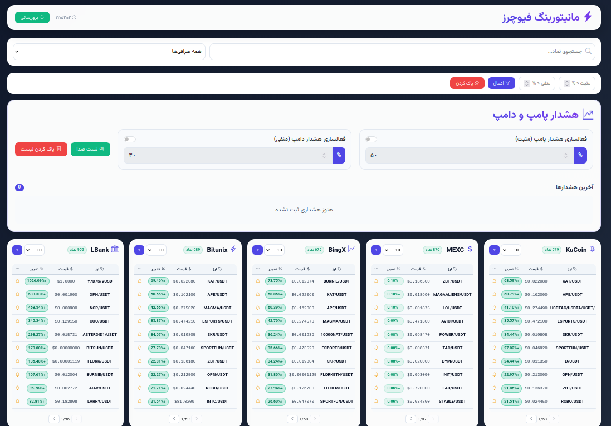

# 🚀 Futures Market Scanner

## 📌 English

A powerful and real-time **Futures Market Scanner** built with Flask that collects and aggregates data from multiple cryptocurrency exchanges.

This application fetches live futures data such as price, volume, 24h change, funding rate, and more, then provides it via a clean API and UI.

---

## ✨ Features

- 🔄 Real-time data updates (multi-threaded)
- 📊 Aggregates data from multiple exchanges:
  - KuCoin
  - MEXC
  - BingX
  - Bitunix
  - LBank
- ⚡ Smart caching system (optimized performance)
- 🔍 Search and filter symbols
- 📈 Sorting (price, change %, etc.)
- 📑 Pagination support
- 🧠 Error handling & retry system
- 🌐 RESTful API endpoints
- 💡 Clean and extendable architecture

---

## 🛠️ Tech Stack

- Python (Flask)
- Requests
- Threading / Concurrent Futures
- JSON APIs
- Logging system

---

## 📂 Project Structure

```
├── app.py
├── templates/
│   └── index.html
├── static/
├── SCREEN.PNG
└── README.md
```

---

## ⚙️ Installation

```bash
git clone https://github.com/your-username/futures-scanner.git
cd futures-scanner
pip install -r requirements.txt
```

---

## ▶️ Run

```bash
python app.py
```

Then open:

```
http://localhost:5000
```

---

## 📡 API Endpoints

### 🔹 Get Live Data
```
GET /api/live-data
```

### 🔹 Symbol Details
```
POST /api/symbol-details
```

### 🔹 Exchanges List
```
GET /api/exchanges
```

### 🔹 Rescan Data
```
POST /api/rescan
```

---

## 🖼️ Screenshot



---

## ⚠️ Notes

- Data is cached to reduce API pressure
- Uses retry & timeout system for stability

---

## 💼 Contact / Purchase

For purchasing or custom development requests, please contact:

📧 devghasemiali@gmail.com

---

# 🚀 اسکنر بازار فیوچرز

## 📌 فارسی

این پروژه یک **اسکنر حرفه‌ای بازار فیوچرز** است که با استفاده از Flask ساخته شده و داده‌های چندین صرافی را به صورت لحظه‌ای جمع‌آوری و نمایش می‌دهد.

این سیستم اطلاعاتی مانند قیمت، حجم، درصد تغییرات، فاندینگ ریت و... را دریافت کرده و از طریق API و رابط کاربری ارائه می‌دهد.

---

## ✨ ویژگی‌ها

- 🔄 بروزرسانی لحظه‌ای با استفاده از Thread
- 📊 پشتیبانی از چند صرافی:
  - KuCoin
  - MEXC
  - BingX
  - Bitunix
  - LBank
- ⚡ سیستم کش هوشمند برای افزایش سرعت
- 🔍 جستجو و فیلتر نمادها
- 📈 مرتب‌سازی بر اساس قیمت و درصد تغییر
- 📑 صفحه‌بندی داده‌ها
- 🧠 مدیریت خطا و retry
- 🌐 API کامل
- 💡 ساختار قابل توسعه

---

## 🛠️ تکنولوژی‌ها

- Python (Flask)
- Requests
- Threading / Concurrent Futures
- JSON API
- Logging

---

## 📂 ساختار پروژه

```
├── app.py
├── templates/
│   └── index.html
├── static/
├── SCREEN.PNG
└── README.md
```

---

## ⚙️ نصب

```bash
git clone https://github.com/your-username/futures-scanner.git
cd futures-scanner
pip install -r requirements.txt
```

---

## ▶️ اجرا

```bash
python app.py
```

سپس باز کنید:

```
http://localhost:5000
```

---

## 📡 API ها

### 🔹 دریافت داده‌ها
```
GET /api/live-data
```

### 🔹 جزئیات نماد
```
POST /api/symbol-details
```

### 🔹 لیست صرافی‌ها
```
GET /api/exchanges
```

### 🔹 اسکن مجدد
```
POST /api/rescan
```

---

## 🖼️ تصویر برنامه


---

## ⚠️ نکات

- برای کاهش فشار روی APIها از کش استفاده شده
- سیستم retry برای پایداری بیشتر

---

## 💼 خرید / ارتباط

برای خرید یا سفارش پروژه‌های اختصاصی:

📧 devghasemiali@gmail.com
